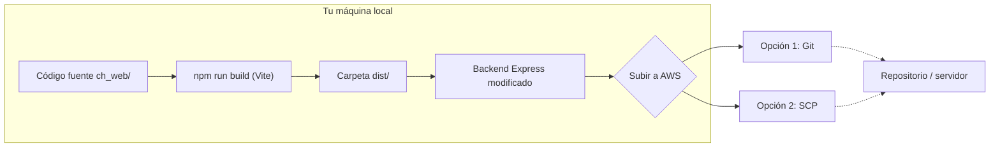
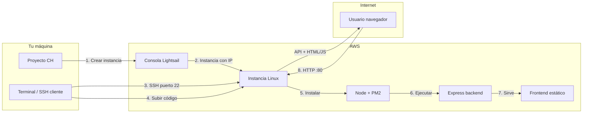

# Notas del proyecto – Control hidráulico

Resumen de lo más importante del chat para continuar mañana con detalles estéticos.

---

## Estados en la interfaz

- **Diagrama y Control:** los estados se muestran con estilo **neutro** (badge blanco, borde gris, sin colores de fondo por estado).
- **Modal de transiciones:** los botones muestran **emojis** según la transición:
  - Verde → 🟩
  - Amarillo → cuadrado amarillo (SVG, no emoji)
  - Rojo → cuadrado rojo (CSS/SVG)
- **Indicador amarillo (🟨):**
  - En el celular vía ngrok el amarillo se veía marrón u oliva según el color usado.
  - Se probaron muchos hex y un fondo blanco solo en el amarillo; al final se **revirtió** todo eso.
  - **Estado actual:** cuadrado amarillo vía **SVG** con `fill="#FFEB3B"`, **sin** fondo blanco ni etiquetas de texto. Archivos: `App.tsx` (YellowSquare) y `nodes/CustomNodes.tsx` (YellowSquare + StatusBadge).
- **Rojo:** cuadrado con color `#E53935` (CSS/SVG). Al usuario le gustó cómo se ve.
- **Verde:** se sigue mostrando el emoji 🟩.

---

## Lógica “En reparación” / “En depósito”

- Cuando a una **bomba, lanchón o soplador** se le asigna el epic **"En reparación"** o **"En depósito"**:
  1. **Backend (`ch_backend/src/index.js`):** al guardar el epic en `POST /api/issues/:key/epic`, si el epic es uno de esos, se llama a `removePuestoLinksForIssue()` y se **borran en Jira** los links "connects to" e "is blocked by" (y "blocks") entre esa issue y cualquier Puesto.
  2. **Frontend:** en el diagrama se **ocultan** las aristas entre ese equipo y su puesto (usando `equipmentNodeIdsReparacionDeposito` y `getPuestoNodeIdFromEquipment` en el filtro de edges).
- Detección del epic por **nombre** (resumen): si contiene "reparación" o "depósito" (case insensitive).

---

## Interfaz general

- **Fondo de página:** `gray.50`.
- **Panel lateral “Sistemas” y contenedor del diagrama:** fondo **blanco**, sin tema oscuro.
- El usuario prefiere esta interfaz (clara) y no la variante con fondos gray.900/gray.800.

---

## Archivos tocados en este chat

- `ch_web/src/App.tsx`: transitionBadge, transitionButtonLabel, YellowSquare, RedSquare, fondos de página y cajas, filtro de edges por epic reparación/depósito.
- `ch_web/src/nodes/CustomNodes.tsx`: StatusBadge, YellowSquare, RedSquare, isYellowStatus, isRedStatus, nodo Comp. Eléctrico.
- `ch_backend/src/index.js`: removePuestoLinksForIssue, POST /api/issues/:key/epic (borrar links cuando epic es En reparación/En depósito).

---

## Para seguir mañana (estética)

- Ajustes visuales que queden pendientes.
- Si se vuelve a tocar el **amarillo**, recordar: en el dispositivo del usuario (celular + ngrok) los hex probados se veían marrón u oliva; el usuario **no** quiere etiquetas de texto, solo emojis/indicadores visuales.

---

# Despliegue en AWS – contexto y Fase 1

Resumen para abrir un nuevo chat e implementar la **Fase 1** (preparación en la máquina local).

## Qué es ch_web

- **ch_web** = la parte que el usuario ve en el navegador (pantallas, botones, diagrama). Es el **frontend**.
- Contiene: `index.html`, carpeta `src/` (App, main.tsx, componentes, estilos), `public/` (icono), configuración (Vite, TypeScript). Las dependencias están en `node_modules/`.
- El **backend** (API, Jira, lógica) está en **ch_backend**; ch_web solo pide datos y los muestra.

## Build y carpeta dist

- **`npm run build`** (en ch_web): primero TypeScript comprueba tipos; luego Vite empaqueta todo el frontend (JS, CSS) y lo deja en **ch_web/dist**. Es la web lista para producción.
- **dist**: carpeta generada por el build; no se edita a mano. Contiene la versión compilada que el servidor debe servir (index.html, JS, CSS, assets). Es la “salida” del build.
- **CSS**: lenguaje que define la apariencia (colores, tamaños, disposición). Archivos como `App.css` e `index.css` en ch_web.

## Express y por qué modificar el backend

- **Express**: librería en Node.js con la que está hecho el servidor de ch_backend. Escucha en un puerto (ej. 4000) y responde a peticiones (rutas `/api/...`).
- Hoy el backend **solo** responde APIs; la web en desarrollo la sirve Vite en otro puerto. En AWS queremos **un solo servidor** que sirva la API y la web.
- **Modificaciones necesarias antes de subir a AWS:**
  1. **Servir archivos estáticos** desde la carpeta donde esté la web compilada (p. ej. `ch_web/dist`): si piden `/`, `index.html`, o `/assets/xxx.js`, Express envía ese archivo.
  2. **Ruta “catch-all”** para la SPA: cualquier ruta que no sea API ni un archivo existente (ej. `/sistema/xyz`) debe devolver el mismo `index.html` para que React maneje la ruta y no dé 404 al recargar.

## Diagrama Fase 1 (en la máquina local)



## Plan de acción – Fase 1 (implementación)

Para un nuevo chat: “Implementar Fase 1 del despliegue en AWS (preparación en local)”:

1. **Build del frontend**
   - En `ch_web`, ejecutar `npm run build`.
   - Comprobar que se genera/actualiza `ch_web/dist` (index.html, assets/, etc.).

2. **Modificar el backend (Express)**
   - En `ch_backend/src/index.js` (o donde se configure la app Express):
     - Servir archivos estáticos desde la carpeta de la web compilada. Si dist está en el mismo repo, algo como `path.join(__dirname, '..', 'ch_web', 'dist')` o la ruta que corresponda; si se copia dist dentro de ch_backend, apuntar ahí.
     - Añadir una ruta catch-all **al final** (después de las rutas `/api/...` y del middleware de estáticos) que envíe `index.html` para cualquier GET que no sea API ni archivo estático.
   - Asegurarse de que las rutas de API sigan teniendo prioridad (definidas antes que el estático y el catch-all).

3. **Probar en local**
   - Arrancar solo el backend (ej. `node ch_backend/src/index.js` o el script que use el proyecto).
   - Abrir en el navegador la URL del backend (ej. `http://localhost:4000`). Debe cargar la web (index.html) y la app React.
   - Probar una ruta interna de la SPA (ej. `/sistema/...`) y recargar: debe seguir mostrando la app, no 404.

4. **Decisión de subida**
   - Dejar anotado si se subirá a AWS por **Git** (clonar/pull en el servidor) o por **SCP** (copiar archivos). No es código; es para la siguiente fase.

Cuando Fase 1 esté hecha y probada en local, se puede continuar con la Fase 2 (en el servidor AWS).

---

## Fase 1 – Completada (feb 2025)

- **Build del frontend:** `npm run build` en `ch_web` genera `ch_web/dist` (index.html, assets/).
- **Backend modificado:** En `ch_backend/src/index.js` se añadió:
  - `express.static` apuntando a `ch_web/dist` (ruta: `path.join(__dirname, '..', '..', 'ch_web', 'dist')`).
  - Ruta catch-all `app.get('*', ...)` que devuelve `index.html` para que la SPA funcione al recargar o entrar por URL directa.
- **Prueba en local:** Arrancar solo el backend (`node ch_backend/src/index.js` desde `ch_backend` o desde la raíz). Abrir `http://localhost:4000`: carga la web; `http://localhost:4000/api/health` responde `{"ok":true}`.
- **Decisión de subida (pendiente de elegir):** Opción A = Git (clonar en el servidor y `npm run build` en `ch_web` ahí). Opción B = SCP (subir `ch_backend` y `ch_web` o solo `ch_backend` + `ch_web/dist`).

---

## Qué subir a GitHub para Fase 2 (repositorio público)

El repo **puede ser público** siempre que **nunca** subas el archivo `.env` (tiene email, API token de Jira, etc.). El `.gitignore` en la raíz ya excluye eso.

**Incluir (se suben solos al hacer `git add` / `git push`):**
- Raíz: `NOTAS.md`, `.gitignore`, `package-lock.json` (si existe en raíz).
- `ch_backend/`: todo **excepto** `node_modules` y `.env`. Incluye: `src/`, `package.json`, `package-lock.json`, `README.md`, `.env.example`.
- `ch_web/`: todo **excepto** `node_modules` y `dist/`. Incluye: `src/`, `public/`, `index.html`, `package.json`, `vite.config.ts`, `tsconfig.*`, `.gitignore`, etc.

**No incluir (el `.gitignore` los deja fuera):**
- `ch_backend/.env` (secretos).
- `ch_web/dist/` (se genera en el servidor con `npm run build`).
- `node_modules/` en backend y frontend.

**Pasos para crear el repo en GitHub:**
1. En GitHub: “New repository”. Nombre ej. `control-hidraulico`. Público. No inicializar con README si ya tenés código.
2. En tu máquina, desde la raíz del proyecto:
   - `git init`
   - `git add .`
   - Revisar con `git status` que no aparezca `.env` ni `ch_backend/.env`.
   - `git commit -m "Fase 1: backend sirve frontend, listo para despliegue"`
   - `git remote add origin https://github.com/TU_USUARIO/control-hidraulico.git`
   - `git branch -M main`
   - `git push -u origin main`

En el servidor (Fase 4) harás `git clone` de ese repo y luego `cd ch_web && npm install && npm run build`.

---

# Plan de acción completo: desplegar la web CH en AWS

*(Origen: `.cursor/plans/despliegue_ch_en_aws_a647adf2.plan.md`)*

Visión: llevar la aplicación Control Hidráulico (frontend + backend) a un servidor en AWS Lightsail: crear la instancia, configurarla por SSH, instalar Node/PM2, subir el proyecto, servir API y web desde el mismo backend, y abrir puertos para acceso por IP (y opcionalmente dominio + HTTPS).

## Flujo general



---

## Fase 1: Preparación en tu máquina (sin tocar AWS aún)

1. **Dejar el proyecto listo para producción**
   - En `ch_web`: ejecutar `npm run build`. Eso genera la carpeta `ch_web/dist` con el frontend compilado.
   - No hace falta definir `VITE_API_BASE_URL` si la API y la web se sirven desde el mismo origen: el front ya usa `API_BASE_URL = ''` por defecto en `ch_web/src/App.tsx` (línea 9), así que las llamadas serán a `/api/...` y funcionarán en el servidor.
2. **Modificar el backend para que sirva la web**
   - Hoy el backend en `ch_backend/src/index.js` solo expone rutas `/api/...` y hace `app.listen(PORT)` al final. No sirve archivos estáticos.
   - Añadir **antes** de `app.listen`:
     - Servir archivos estáticos desde la carpeta del frontend compilado (por ejemplo `ch_web/dist` o la ruta donde se coloque ese `dist` en el servidor).
     - Una ruta “catch-all” (fallback) que devuelva `index.html` para rutas no encontradas, así el enrutado del front (React) funciona al recargar o entrar por URL directa.
   - Así un solo proceso Node sirve tanto la API como la web en el mismo puerto (p. ej. 4000 o 80).
3. **Decidir cómo subirás el código al servidor**
   - **Opción A:** Subir el repo a GitHub/GitLab y en el servidor hacer `git clone` + construir frontend ahí.
   - **Opción B:** Subir las carpetas `ch_backend` y `ch_web` (o el build `ch_web/dist`) por SCP/SFTP (FileZilla, WinSCP, o `scp` desde terminal).

---

## Fase 2: Crear el servidor en AWS Lightsail

1. **Crear la instancia**
   - Entrar a la consola de AWS → **Lightsail** → “Create instance”.
   - Región: la más cercana a vos o a quienes usen la app.
   - Imagen: **Linux/Unix** → **Ubuntu** (o la opción recomendada).
   - Plan: el más barato suele alcanzar (ej. 3.50 USD/mes).
   - Nombre: ej. `ch-production`.
   - Crear instancia.
2. **Anotar IP y descargar la llave SSH**
   - En la ficha de la instancia verás la **IP pública** (ej. `3.123.45.67`). La vas a usar para SSH y luego para abrir la web.
   - En “Account” → “Account” → “SSH keys” (o el enlace que Lightsail indique) descargar la llave para la zona donde creaste la instancia. Es un archivo `.pem`; guardalo en un lugar seguro (ej. `~/Downloads/lightsail-key.pem` o en tu usuario de Windows).
3. **Abrir puertos en el firewall de Lightsail**
   - En la instancia → pestaña “Networking” (o “Red”).
   - Añadir regla: **HTTP** (puerto 80) desde cualquier IP (`0.0.0.0/0`), para que el navegador pueda entrar.
   - Opcional: **HTTPS** (443) si más adelante configurás dominio y certificado.
   - El puerto 22 (SSH) suele venir abierto por defecto para que puedas conectarte.

---

## Fase 3: Conectarte por SSH y preparar el servidor

1. **Conectarte por SSH**
   - En Windows: PowerShell o la terminal de Cursor; si usás la llave descargada (ej. `lightsail-key.pem` en `Downloads`):
   - Aceptar el mensaje de “fingerprint” la primera vez. Entrás como usuario `ubuntu` (o el que indique Lightsail) a la terminal **del servidor**.
2. **Instalar Node.js en el servidor**
   - Ejemplo con Node 20 LTS (ejecutar en la sesión SSH).
   - Alternativa: instalar [nvm](https://github.com/nvm-sh/nvm) y luego `nvm install 20` y `nvm use 20`.
3. **Instalar PM2 (opcional pero recomendado)**
   - Para que el backend quede corriendo y se reinicie si se cae.
   - Luego podés configurar `pm2 startup` para que el proceso arranque al reiniciar la máquina.

---

## Fase 4: Subir el proyecto y configurar el backend

1. **Subir el código a la instancia**
   - **Si usás Git:** en el servidor (por SSH): `git clone https://github.com/TU_USUARIO/TU_REPO.git` (o la URL de tu repo), luego entrar al directorio. Asegurate de tener ahí tanto `ch_backend` como `ch_web` (y en `ch_web` poder hacer `npm run build`).
   - **Si usás SCP:** desde tu PC (en otra terminal, no dentro de SSH), desde la raíz del proyecto:
     ```bash
     scp -i "ruta/a/tu.pem" -r ch_backend ch_web ubuntu@TU_IP_PUBLICA:~/
     ```
     Luego por SSH en el servidor, si hace falta, generá el build del front: `cd ch_web && npm install && npm run build`.
2. **Estructura esperada en el servidor**
   - Que el backend pueda resolver la ruta al `dist` del frontend. Por ejemplo:
     - `~/proyecto/ch_backend`  → código del backend
     - `~/proyecto/ch_web/dist` → contenido generado por `npm run build`
   - La modificación en el backend debe servir esa carpeta `ch_web/dist` y el fallback a `index.html` (Fase 1, paso 2).
3. **Crear el archivo .env en el servidor**
   - Dentro de la carpeta del backend en el servidor (ej. `~/proyecto/ch_backend`):
   - Pegar las mismas variables que tenés en tu `ch_backend/.env` local: `PORT`, `JIRA_BASE_URL`, `JIRA_EMAIL`, `JIRA_API_TOKEN`, `JIRA_PROJECT_KEY`, `JIRA_ISSUE_KEYS`. Ajustar `PORT` si querés que escuche en 80 (requiere permisos o un proxy) o dejarlo en 4000 y usar un proxy inverso (nginx) en 80; para empezar simple, se puede dejar en 4000 y exponer solo el 4000 temporalmente, o configurar Express para escuchar en 80 con `sudo`/capabilities (no ideal) o poner nginx delante (recomendable a medio plazo).
4. **Instalar dependencias del backend y arrancar**
   - En el servidor: `npm install`, luego arrancar el backend (ej. `node src/index.js` o el script definido).
   - Si ves el mensaje de “Backend CH escuchando en…”, el backend está corriendo. Probá desde tu navegador: `http://TU_IP_PUBLICA:4000` (y si servís estáticos, debería mostrar la web y las llamadas a `/api` funcionar).
   - Para dejarlo en segundo plano y que se reinicie: `pm2 start src/index.js --name ch-backend`, luego `pm2 save` y `pm2 startup` según indique PM2.

---

## Fase 5: Exponer por el puerto 80 (recomendado para “ver la web en línea”)

1. **Escuchar en el puerto 80**
   - En Linux, los puertos por debajo de 1024 requieren privilegios. Dos opciones:
     - **Opción simple:** Cambiar en el `.env` del servidor a `PORT=80` y arrancar el backend con `sudo` (no ideal por seguridad) o usar `setcap` para dar a Node permiso de abrir el 80:  
       `sudo setcap 'cap_net_bind_service=+ep' $(which node)`  
       Luego en `.env`: `PORT=80` y reiniciar con PM2.
     - **Opción recomendada:** Dejar el backend en 4000 y poner **nginx** como proxy: nginx escucha en 80, redirige todo (o solo `/api` y los estáticos según cómo lo configures) al `localhost:4000`. Así no hace falta que Node toque el 80.
2. **Probar desde fuera**
   - En el navegador: `http://TU_IP_PUBLICA` (o `http://TU_IP_PUBLICA:4000` si solo abriste el 4000). Deberías ver la web CH y que Control, diagramas y Jira funcionen si el `.env` está bien.

---

## Fase 6 (opcional): Dominio y HTTPS

1. **Dominio**
   - Comprar o usar un dominio que tengas. En el DNS del dominador, crear un registro **A** apuntando a la **IP pública** de la instancia Lightsail.
2. **HTTPS con Let's Encrypt**
   - En el servidor instalar Certbot y obtener un certificado para tu dominio (Certbot puede configurar nginx si lo usás). Así la web queda en `https://tudominio.com`.

---

## Resumen de orden sugerido

| Paso  | Dónde            | Acción                                                                                  |
| ----- | ---------------- | --------------------------------------------------------------------------------------- |
| 1–2   | Local            | Build del frontend y modificar backend para servir `dist` + fallback SPA                |
| 3     | Local            | Decidir Git vs SCP para subir código                                                    |
| 4–6   | AWS Consola      | Crear instancia Lightsail, anotar IP, descargar .pem, abrir puerto 80 (y 22 si no está) |
| 7–9   | SSH al servidor  | Conectar por SSH, instalar Node y PM2                                                   |
| 10–11 | Servidor + local | Subir proyecto (Git o SCP) y generar `ch_web/dist` si hace falta                          |
| 12–13 | Servidor         | Crear `.env` en backend, `npm install`, arrancar con Node/PM2                            |
| 14–15 | Servidor + AWS   | Exponer puerto 80 (backend directo o nginx) y probar con la IP                           |
| 16–17 | Opcional         | Dominio (A record) y HTTPS con Certbot                                                 |

---

## Archivos clave del proyecto

- `ch_web/src/App.tsx`: `API_BASE_URL` en línea 9; si queda vacío, las peticiones van al mismo origen (mismo servidor).
- `ch_backend/src/index.js`: punto donde añadir `express.static` y fallback para SPA antes de `app.listen`.
- `ch_backend/.env`: referencia de variables a replicar en el servidor (nunca subir este archivo con datos reales al repo; crearlo a mano en el servidor).

---

# Resumen de la sesión de despliegue (feb 2026)

Lo más importante de lo que hicimos hoy: repo en GitHub, instancia Lightsail, SSH, Node, PM2, clonado del proyecto, build, backend en producción y acceso por navegador.

## Instancia y acceso SSH

- **Instancia:** `control-hidraulico`, Ohio (us-east-2), Ubuntu 22.04 LTS, 1 GB RAM, 40 GB SSD.
- **IP pública (Static IP):** `3.138.205.241` — usar esta para SSH y para abrir la web en el navegador.
- **Llave SSH:** `LightsailDefaultKey-us-east-2.pem` (descargar desde Lightsail → Account → SSH keys → región Ohio). En Windows suele estar en `C:\Users\TU_USUARIO\Downloads\`.
- **Conectarse por SSH (desde PowerShell o terminal de Cursor):**
  ```powershell
  ssh -i "C:\Users\augus\Downloads\LightsailDefaultKey-us-east-2.pem" ubuntu@3.138.205.241
  ```
- Si la sesión SSH se corta (`Connection reset`), no se pierde nada: volver a ejecutar el mismo comando. Node, PM2 y el código instalado/clonado siguen en el servidor.

## Repositorio en GitHub

- **Repo:** `https://github.com/Jira-Cacheuta/control-hidraulico` (organización Jira-Cacheuta). Código ya subido; `.env` nunca va al repo.

## Lo que ya está hecho en el servidor (Fase 3 y 4)

1. **Node.js 20** y **PM2** instalados (global con `sudo npm install -g pm2`).
2. **Proyecto clonado:** `~/control-hidraulico` (contiene `ch_backend`, `ch_web`, etc.).
3. **Archivo `.env`** creado a mano en `~/control-hidraulico/ch_backend/.env` (mismas variables que en local: PORT, JIRA_*). No está en GitHub; solo existe en el servidor.
4. **Dependencias:** `npm install` en `ch_backend` y en `ch_web`.
5. **Build del frontend:** `npm run build` en `ch_web` → se genera `ch_web/dist`.
6. **Backend con PM2:** desde `~/control-hidraulico/ch_backend` se ejecutó `pm2 start src/index.js --name ch-backend`. El proceso se llama `ch-backend`.
7. **PM2 al reinicio:** se ejecutó `pm2 startup` (el comando `sudo env PATH=...` que mostró PM2) y luego `pm2 save`. Así, al reiniciar la instancia, PM2 arranca y vuelve a levantar `ch-backend`.

## Firewall (Lightsail)

- En la instancia → pestaña **Networking** deben estar abiertos:
  - **SSH (22)** para conectarse.
  - **HTTP (80)** si el backend escucha en 80.
  - Si el backend escucha en **4000**, hay que añadir una regla para el puerto **4000** (TCP) desde cualquier IPv4; si no, el navegador no puede conectar y da timeout.
- URL de la web según puerto:
  - Con **PORT=4000** y regla 4000 abierta: `http://3.138.205.241:4000`
  - Con **PORT=80** (y regla 80 abierta): `http://3.138.205.241`

## Pasar el backend a puerto 80 (opcional)

Para entrar con `http://3.138.205.241` sin `:4000`:

1. En el servidor (por SSH): `sudo setcap 'cap_net_bind_service=+ep' $(which node)`
2. Editar `.env`: `nano ~/control-hidraulico/ch_backend/.env` → cambiar `PORT=4000` a `PORT=80` → guardar (Ctrl+O, Enter, Ctrl+X).
3. Reiniciar: `pm2 restart ch-backend`
4. Probar en el navegador: `http://3.138.205.241`. Opcional: quitar la regla del puerto 4000 en Lightsail si ya no se usa.

## Comandos útiles en el servidor

- **Ver procesos PM2:** `pm2 list` (muestra id, name, status, cpu, memory).
- **Reiniciar el backend:** `pm2 restart ch-backend`
- **Logs del backend:** `pm2 logs ch-backend`
- **Salir de SSH:** `exit` o Ctrl+D.

## Recordatorios rápidos

- **Nano:** editor de texto en la terminal del servidor; Ctrl+O guarda, Ctrl+X sale.
- **pm2 list:** la tabla muestra los procesos gestionados por PM2; “online” = corriendo.
- Lo instalado (Node, PM2, paquetes npm, código clonado) persiste aunque te desconectes; solo hay que volver a conectar por SSH para seguir trabajando.

---

# Resumen de la sesión – cambios UI, Gruta 3 y estados Jira (feb 2026)

Para retomar en un nuevo chat: cambios de interfaz, nuevos nodos en Gruta 3 y configuración para que traigan estado/summary desde Jira.

## Recuadro de aviso en Sistema Gruta Nº1

- El texto de aviso (“Cambiar de estado la bomba… afecta al Sistema Hidro…”) está **debajo del diagrama**, no superpuesto.
- Implementación en `ch_web/src/App.tsx`: el contenedor del diagrama es un flex en columna; arriba el ReactFlow (flex 1), abajo un `Box` con el texto solo cuando `currentSystem === 'gruta1'`. Igual en vista móvil y escritorio.

## Sistema Gruta Nº3 – Cañería CH-695 y Servicio CH-696

- **Nodos agregados** en `gruta3NodesInitial` (App.tsx):
  - Cañería: `id: 'gruta3-cañeria2'`, tipo `pipeSegment`, `issueKey: 'CH-695'`, posición (500, 420).
  - Servicio: `id: 'gruta3-servicio2'`, tipo `cloudService`, `issueKey: 'CH-696'`, posición (500, 520).
- **Edges:** Puesto → cañería CH-695 (handle out-bottom-right); cañería CH-695 → servicio CH-696 (out-bottom → in-top).
- El tipo `cloudService` ya recibe el **summary** de Jira como label en `applyIssueData` (junto con `service` y `waveService`).

## Estados y summary desde Jira (CH-695 y CH-696)

- El backend en `GET /api/issues` usa `req.query.keys || JIRA_ISSUE_KEYS`. Si el front no manda `keys`, se usan las keys del `.env`.
- Para que CH-695 y CH-696 traigan **estado** y (para CH-696) **summary**, hay que agregarlos a **JIRA_ISSUE_KEYS** en `ch_backend/.env`:
  - En local: ya se agregaron `CH-695` y `CH-696` al final de la lista en `ch_backend/.env`.
  - En el servidor: si no están, editar `~/control-hidraulico/ch_backend/.env` con `nano` y añadir `,CH-695,CH-696` al final de `JIRA_ISSUE_KEYS`, luego `pm2 restart ch-backend`.

## Estado del nodo cloudService (no tape el texto)

- En `ch_web/src/nodes/CustomNodes.tsx`, en **CloudServiceNode**, el `StatusBadge` usa por defecto `bottom={data?.statusBottom ?? -16}` para que el badge quede **debajo** del ícono y no tape el summary. Si hace falta otra posición en un nodo concreto, se puede usar `statusBottom` en los datos del nodo.

## Desplegar estos cambios en el servidor

**En la PC (raíz del proyecto):**
```bash
git add .
git status   # revisar que no aparezca .env
git commit -m "Recuadro Gruta 1 debajo, cloudService estado abajo, etc."
git push origin main
```

**En el servidor (por SSH):**
```bash
ssh -i "C:\Users\augus\Downloads\LightsailDefaultKey-us-east-2.pem" ubuntu@3.138.205.241
cd ~/control-hidraulico
git pull origin main
cd ch_web
npm run build
cd ../ch_backend
pm2 restart all
```

Si en el servidor faltan CH-695 y CH-696 en `.env`: `nano .env`, agregar al final de `JIRA_ISSUE_KEYS` `,CH-695,CH-696`, guardar, luego `pm2 restart all`.

**Verificar:** `http://3.138.205.241` (o con `:4000` si el backend sigue en 4000) — Gruta Nº1 con recuadro abajo; Gruta Nº3 con CH-695 y CH-696 mostrando estado y el servicio con summary y estado debajo del ícono.
